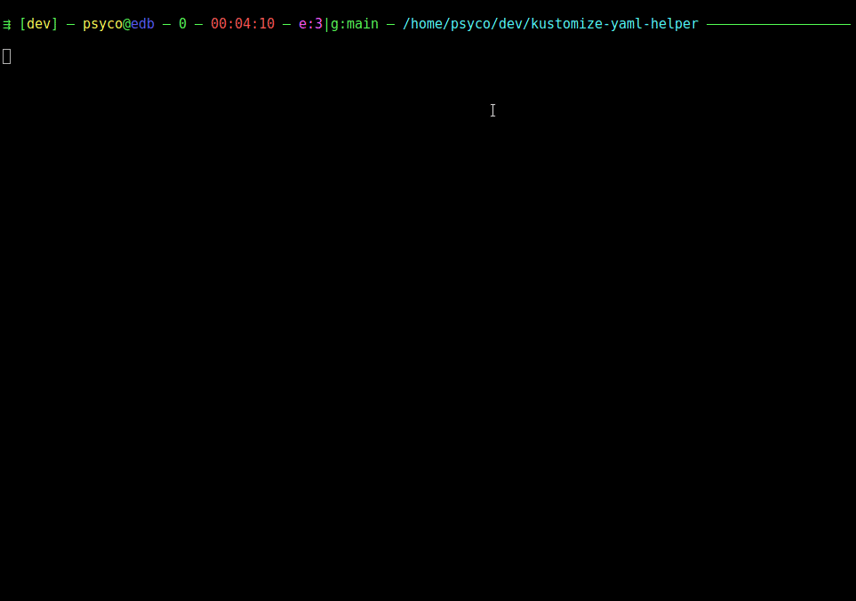
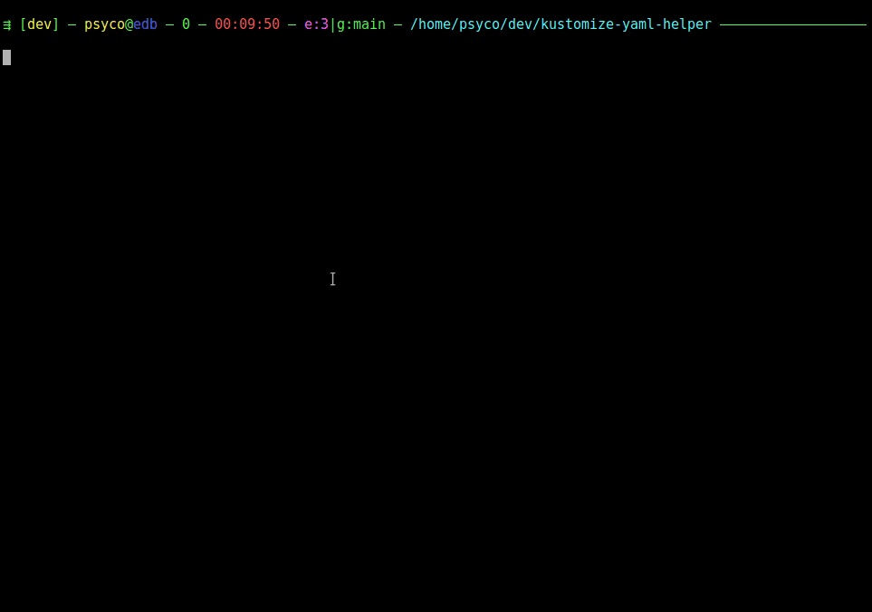
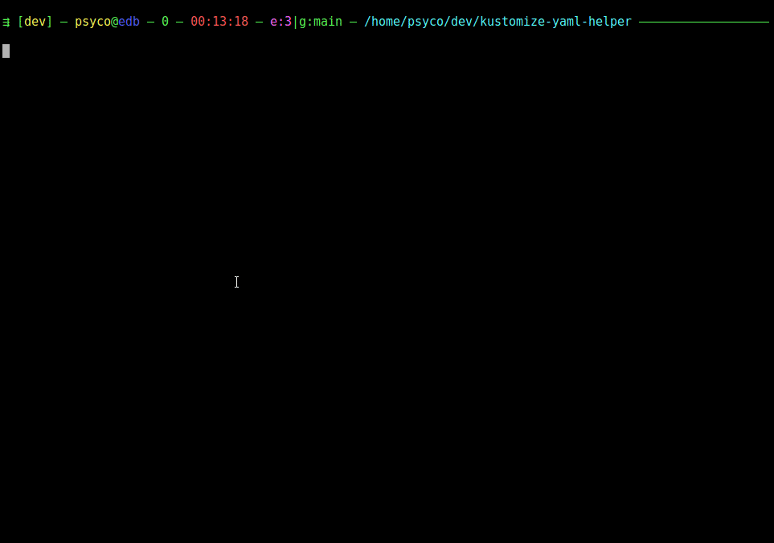

This package provides basic tools for working with k8s [kutomize](https://kustomize.io/).


<!-- markdown-toc start - Don't edit this section. Run M-x markdown-toc-refresh-toc -->
**Table of Contents**

- [Prerequisite](#prerequisite)
- [Installation](#installation)
- [See it in action](#see-it-in-action)
- [Example configuration](#example-configuration)
- [Package definitions](#package-definitions)

<!-- markdown-toc end -->

## Prerequisite

The package relies on a yaml helper binary that can be installed from https://github.com/psycofdj/kustomize-yaml-helper

## Installation

- `git clone https://github.com/psycofdj/kustomize-emacs.git`
- `cd kustomize`
- `make install`

## See it in action

- Get kustomization patches in [JSONPatches6902](https://datatracker.ietf.org/doc/html/rfc6902) format



- Open kustomization referenced file or directory



- Navigate between overlays



## Example configuration

```lisp
  (if (require 'kustomize nil 'noerror)
      (progn
        (when (kustomize-in-kustomize-file)
          (define-key global-map [f12]              'kustomize-open-at-point)
          (define-key global-map (kbd "C-<f12>")    'kustomize-open-at-point-other-window)
          (define-key global-map "\C-e"             'kustomize-patch-at-point)
          (kustomize-which-func))
        (when (kustomize-in-dir-strcture)
          (define-key global-map (kbd "C-x C-<up>") 'kustomize-open-overlay))
        )
    (message "unable to initialize kustomize")
    )
```

## Package definitions

| Function                                             | Description                                                       |
|------------------------------------------------------|-------------------------------------------------------------------|
| `kustomize-get-patch-at-point(&optional pline pcol)` | returns JSON6901 paht of symbol under cursor                      |
| `kustomize-resolve-at-point(&optional pline pcol)`   | returns file path under cursor regarding to current file path     |
| `kustomize-which-func`                               | adds `patch-at-point` to `which-func-functions` hooks             |
| `kustomize-get-root`                                 | returns `kustomization.yaml` directory closest to current file    |
| `kustomize-get-base`                                 | returns `base` directory closest to current file                  |
| `kustomize-in-kustomize-file`                        | returns `t` if detects kustomization format in current file       |
| `kustomize-in-dir-strcture`                          | returns `t` if current file is in a kustomize directory structure |


| Interactive                            | Description                                                                                                                                             |
|----------------------------------------|---------------------------------------------------------------------------------------------------------------------------------------------------------|
| `kustomize-patch-at-point`             | calls `patch-at-point` interactively, copy result into kill-ring                                                                                        |
| `kustomize-open-at-point`              | calls `resolve-at-point` interactively, open-file result if exists. When symbol is a directory, looks for a `kustomization.yaml` file in that directory |
| `kustomize-open-at-point-other-window` | like `kustomize-open-at-point` but opens file in another window                                                                                         |
| `kustomize-open-overlay`               | search available overlays, prompt selection with IDO and open selected file `kustomization.yaml` file                                                   |

| Customize                   | Description                                                                                                           |
|-----------------------------|-----------------------------------------------------------------------------------------------------------------------|
| `kustomize-yaml-helper-bin` | path to `kustomize-yaml-helper` binary, default to `kustomize-yaml-helper` which expects binary to be present in PATH |
